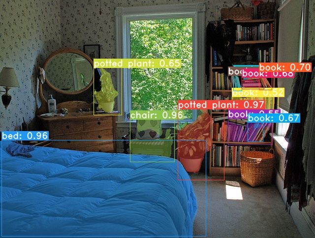
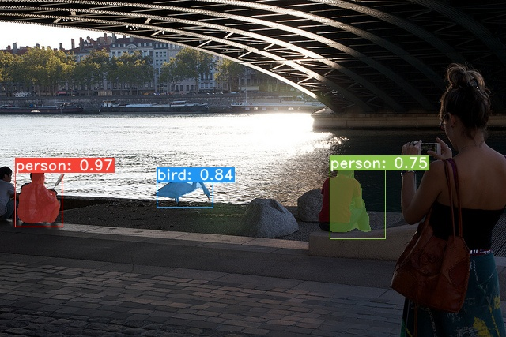
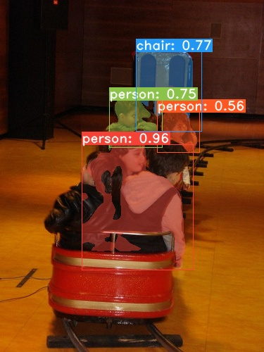

# yolact_onnx

YOLACT official code address: [https://github.com/dbolya/yolact/](https://github.com/dbolya/yolact/ "YOLACT")

YOLACT：[https://arxiv.org/abs/1904.02689](https://arxiv.org/abs/1904.02689)
YOLACT++：[https://arxiv.org/abs/1912.06218](https://arxiv.org/abs/1912.06218)
DCN：[https://arxiv.org/abs/1703.06211](https://arxiv.org/abs/1703.06211)

Pytorch convert to ONNX:

github: [https://github.com/Ma-Dan/yolact/tree/onnx](https://github.com/Ma-Dan/yolact/tree/onnx)

CSDN: [https://blog.csdn.net/qq_37532213/article/details/121671389](https://blog.csdn.net/qq_37532213/article/details/121671389)

ZhiHu: [https://zhuanlan.zhihu.com/p/128974102](https://zhuanlan.zhihu.com/p/128974102)

**Note: We only implemented the forward reasoning of the YOLACT onnx model with DarkNet53 as the backbone. Other models are similar and can be modified and applied appropriately.

**The forward reasoning code completely abandons the dependence on torch and tensor, and uses numpy to express the data completely.**In addition, since YOLACT++ uses the DCNv2 operator, and onnx does not support dynamic convolution operators, it cannot be converted to onnx.

**If you must convert it, you can try using OpenCV's dynamic convolution or use normal convolution instead.

How our project uses:

Please download yolact_darknet53.onnx from Baidu network disk and place it in the ./model directory.

Baidu network disk address: [https://pan.baidu.com/s/1r8Fss-IuxJ9yBDQxYUf3Rg](https://pan.baidu.com/s/1r8Fss-IuxJ9yBDQxYUf3Rg), extraction code: **koex**

```python
#Install dependency environment, we use python 3.7.11
pip install -r requriements.txt
```

```python
#View help instructions
python yolact_onnx_detect.py -h
usage: yolact_onnx_detect.py [-h] [--images IMAGES] [--image IMAGE]
                             [--onnx ONNX] [--dst DST] [--net_w NET_W]
                             [--net_h NET_H] [--conf_thr CONF_THR]
                             [--nms_thr NMS_THR] [--top_k TOP_K]

optional arguments:
  -h, --help           show this help message and exit
  --images IMAGES      input images path
  --image IMAGE        input image file
  --onnx ONNX          onnx model file
  --dst DST            detection results save path
  --net_w NET_W        networks input width
  --net_h NET_H        networks input height
  --conf_thr CONF_THR  detect confidence thresh
  --nms_thr NMS_THR    detection fast nms thresh
  --top_k TOP_K        max detection object number
```


```python
#execute script
python yolact_onnx_detect.py --images ./img/ --onnx ./model/yolact_darknet53.onnx --dst ./rslts/
```

Visualization of inspection results：






